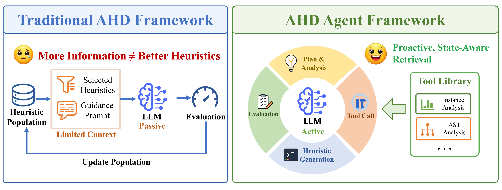
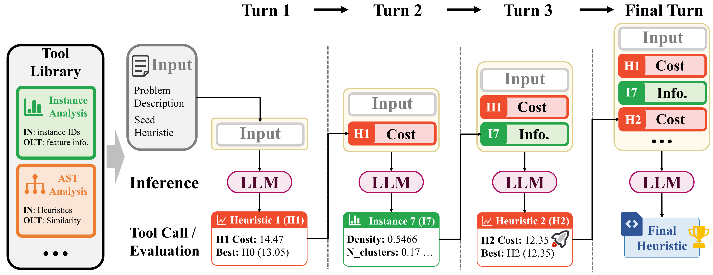
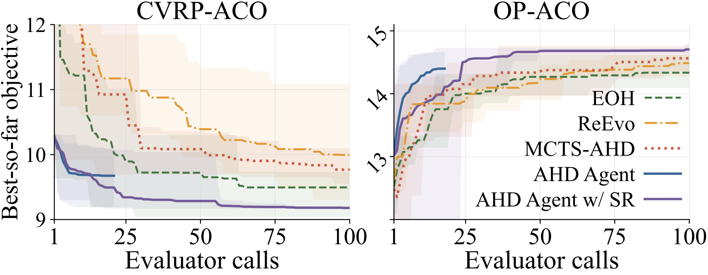
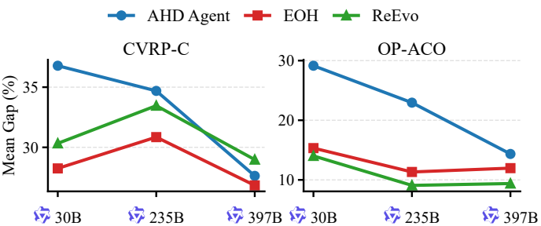
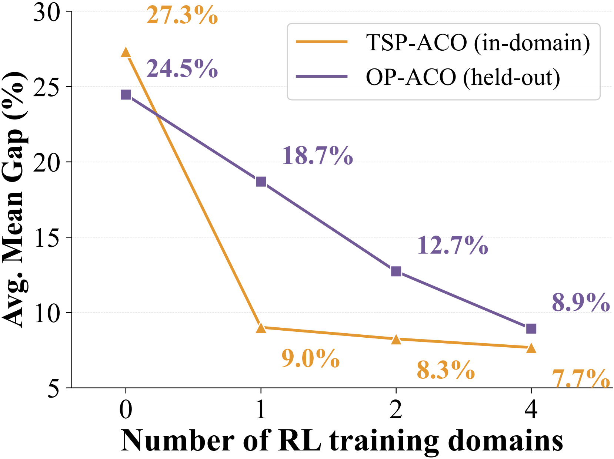
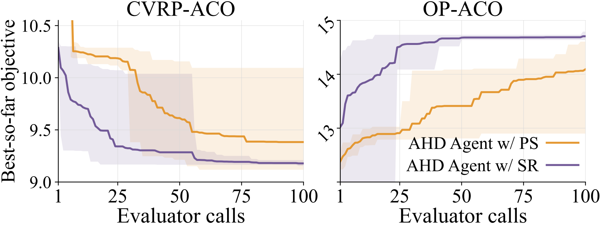

# 

<h1 style="display: flex; justify-content: center; align-items: center; gap: 10px; margin: 0;">
  AHD Agent: Agentic Reinforcement Learning for Automatic Heuristic Design
</h1>
<em>Haoze Lv*, Ning Lu*, Ziang Zhou, Shengcai Liu📧</em>

  

  
  

 

  <strong>A tool-integrated, multi-turn LLM agent trained with reinforcement learning for automatic heuristic design.</strong>

------

## Highlights

- **Tool-using AHD agent:** Proactively uses tools in multi-turn heuristic generation.
- **Agentic RL training:** Learns from synthesized AHD environments with multi-domain training.
- **Efficient and generalizable:** A 4B agent outperforms larger-model baselines across various domains.

---

## Agent Loop

AHD Agent keeps an interaction history and makes state-dependent decisions over multiple turns. The agent can:

1. generate or revise a heuristic,
2. evaluate the candidate heuristic on a design set,
3. call tools to collect targeted feedback,
4. continue the design process or return the final heuristic.

  

  <em>AHD Agent workflow: the model iteratively uses feedback, tools, and evaluations to improve heuristics.</em>

## Results

We evaluate AHD Agent across eight settings spanning constructive heuristics, ant-colony-optimization heuristics, held-out combinatorial domains, and cost-aware Bayesian optimization.

### Efficient Design-Time Convergence

On RL training domains, the agent reaches competitive or superior gaps with only about **11-15 evaluator calls** in the short setting. The design-time convergence curves show that AHD Agent improves quickly under limited evaluation budgets and continues to benefit when the budget is expanded.

  

  <em>AHD Agent converges faster and achieves better performance under larger evaluation budgets.</em>

### Potential from Stronger Backbones

AHD Agent has strong potential to improve with stronger LLM backbones. Model scaling produces more consistent gains for the agentic multi-turn paradigm than for fixed-workflow AHD methods, suggesting that stronger reasoning ability is better converted into heuristic-design performance when the model controls the design process.

  

  <em>Performance improves as the backbone model becomes stronger.</em>

### Cross-Domain Generalization

The RL-trained agent generalizes beyond the domains used during training. As the number of RL training domains increases, performance improves not only on in-domain tasks but also on held-out domains, indicating that cross-domain RL training learns transferable heuristic-design behavior.

  

  <em>Held-out performance improves as the training mixture covers more domains.</em>

### Inference-Time Scaling

AHD Agent can also be enhanced at inference time by increasing the evaluator budget. Continuing one coherent multi-turn trajectory can be more effective than aggregating independent short trajectories, because later revisions can exploit accumulated feedback from earlier turns.

  

  <em>Sequential refinement benefits from accumulated feedback under larger evaluation budgets.</em>

## Contact

For questions about the paper, please contact Shengcai Liu at <liusc3@sustech.edu.cn>.
