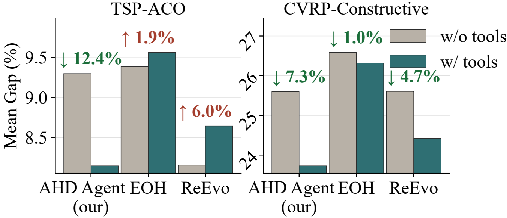
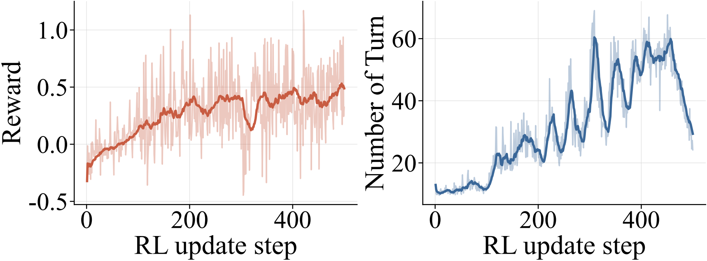

# AHD Agent: Agentic Reinforcement Learning for Automatic Heuristic Design

  <strong>A tool-integrated, multi-turn LLM agent trained with reinforcement learning for automatic heuristic design.</strong>

  <a href="#overview">Overview</a> |
  <a href="#method">Method</a> |
  <a href="#results">Results</a> 

## Overview

Automatic heuristic design (AHD) aims to automatically discover high-performing heuristics for hard optimization problems. Recent LLM-based AHD methods show strong potential, but most of them place the LLM inside a fixed search workflow: the model receives a static prompt, generates a heuristic, and relies on a manually designed outer loop for evaluation and revision.

**AHD Agent** takes a different view. Instead of treating the LLM as a passive heuristic generator, we formulate heuristic design as a **tool-integrated, multi-turn decision process**. At each step, the agent can decide whether to generate a candidate heuristic, evaluate it, or call tools to retrieve targeted evidence from the solving environment. This enables state-dependent feedback acquisition and adaptive heuristic revision.

We further train a compact 4B-parameter agent with an agentic reinforcement learning system. The RL environment synthesis pipeline constructs diverse heuristic-design tasks by varying problem domains, instance distributions, solver backbones, and seed heuristics, improving the agent's generalizable AHD capability across domains.

## Key Ideas

- **Agentic heuristic design.** AHD is modeled as an interactive process where the LLM controls when to generate, evaluate, and use tools.
- **Tool-integrated feedback.** Diagnostic tools expose targeted information such as instance statistics, evaluator feedback, and heuristic-level signals.
- **RL-trained design policy.** The agent is optimized with reinforcement learning to produce executable, feasible, and high-quality heuristics.
- **Cross-domain generalization.** Multi-domain RL training improves both in-domain performance and held-out generalization.
- **Efficient search.** The trained 4B agent matches or surpasses strong LLM-AHD baselines using fewer heuristic evaluations.

  

  <em>Traditional fixed-workflow AHD vs. the proposed agentic multi-turn AHD framework.</em>

## Method

Traditional LLM-based AHD frameworks usually follow a fixed workflow. In contrast, AHD Agent keeps an interaction history and makes state-dependent decisions over multiple turns. The agent can:

1. generate or revise a heuristic,
2. evaluate the candidate heuristic on a design set,
3. call tools to collect targeted feedback,
4. continue the design process or return the final heuristic.

The workflow starts from a problem description and an initial heuristic. The agent proposes a candidate, receives evaluator feedback, optionally invokes diagnostic tools, and uses the accumulated interaction history to decide the next revision. This loop repeats until the agent returns the final heuristic, making the design process adaptive rather than a fixed generate-and-evaluate pipeline.

  

  <em>AHD Agent workflow: the model iteratively uses feedback, tools, and evaluations to improve heuristics.</em>

## Results

We evaluate AHD Agent across eight settings spanning constructive heuristics, ant-colony-optimization heuristics, held-out combinatorial domains, and cost-aware Bayesian optimization.

### Tool Access Depends on the Framework

Simply adding tools to a fixed workflow is not enough. Diagnostic tools provide the clearest benefit when the LLM can decide when and how to use them. AHD Agent turns tool access into state-dependent feedback acquisition, while fixed-workflow baselines can receive the same information but integrate it less effectively.

  

  <em>Diagnostic tools help the multi-turn agent more reliably than fixed-workflow LLM-AHD methods.</em>

### Efficient Design-Time Convergence

On RL training domains, the agent reaches competitive or superior gaps with only about **11-15 evaluator calls** in the short setting. The design-time convergence curves show that AHD Agent improves quickly under limited evaluation budgets and continues to benefit when the budget is expanded.

  

  <em>AHD Agent converges faster and achieves better performance under larger evaluation budgets.</em>

### Potential from Stronger Backbones

AHD Agent has strong potential to improve with stronger LLM backbones. Model scaling produces more consistent gains for the agentic multi-turn paradigm than for fixed-workflow AHD methods, suggesting that stronger reasoning ability is better converted into heuristic-design performance when the model controls the design process.

  

  <em>Performance improves as the backbone model becomes stronger.</em>

### Cross-Domain Generalization

The RL-trained agent generalizes beyond the domains used during training. As the number of RL training domains increases, performance improves not only on in-domain tasks but also on held-out domains, indicating that cross-domain RL training learns transferable heuristic-design behavior.

  

  <em>Held-out performance improves as the training mixture covers more domains.</em>

### Inference-Time Scaling

AHD Agent can also be enhanced at inference time by increasing the evaluator budget. Continuing one coherent multi-turn trajectory can be more effective than aggregating independent short trajectories, because later revisions can exploit accumulated feedback from earlier turns.

  

  <em>Sequential refinement benefits from accumulated feedback under larger evaluation budgets.</em>

### RL Training Dynamics

During RL training, reward increases over 500 steps while the number of interaction turns stabilizes, showing that the agent learns a more effective multi-turn design policy rather than merely extending trajectories.

  

  <em>Reward and interaction behavior evolve throughout RL training.</em>

## Contact

For questions about the paper, please contact Shengcai Liu at <liusc3@sustech.edu.cn>.
